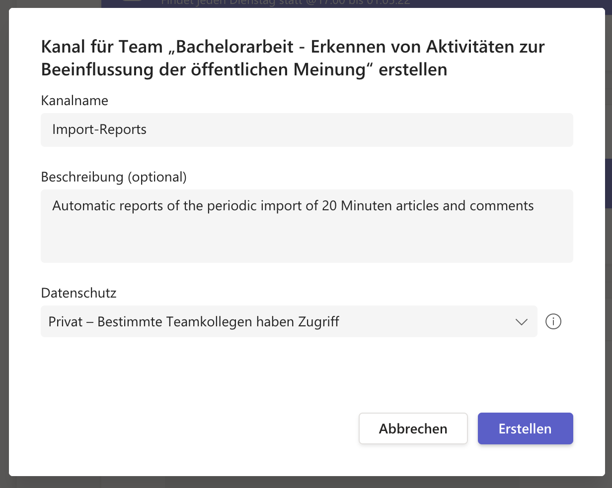

# Fetching articles and comments from the 20 Minuten API
 
## About

This Java Spring Boot application loads the comments for the newest articles on from 20minuten.ch every four hours.

The Application uses the RSS feed and the unofficial API from 20 Minuten to fetch the articles and comments. The comments are converted into a custom data structure and then stored in a database.

## Spring Scheduler

Spring Scheduler is used to automatically start the import every 4 hours (see class RSSFeedsImporter):

```
@Scheduled(cron="0 0 1,5,9,13,17,21 * * ?") //every day at 1:00, 5:00, 9:00, 13:00, 17:00, 21:00
public List<ArticleImportResult> importCommentsFromNewArticles() {...}
```

## Local Installation

**Note: This installation guide shows the installation for the IntelliJ IDE and a Postegre-Database but the project is
compatible with other IDEs and databases too**

### 1. Setting up a Postgre SQL database

- 1.1: Install Postgres
- 1.2: Start the Postgres Database Server
- 1.3: Open Command Line Tool

```
	psql postgres
```

- 1.4: Create a New User:

```
	CREATE ROLE newUser WITH LOGIN PASSWORD ‘password’;
	ALTER ROLE newUser CREATEDB;
```

- 1.5: Start a new Session with the new user

```
	\q
	psql postgres -U newuser
```

- 1.6: Create a new database. This can be done with pgAdmin or another tool. The tables will automatically be created
  later by the Spring Boot Application.


### 2. Open the project in the IDE

- 2.1: Install Maven dependencies


- 2.2: Install the Lombok Plugin for the IDE. Lombok is used to avoid writting repetitive Java Code like setters,
  getters, constructors…


- 2.3: Create a new local config-file. Ignore the file from git if it is not already ignored.

```
spring.datasource.url=jdbc:postgresql://localhost:5432/comments
spring.datasource.username=newuser
spring.datasource.password=secret-password (replace with your password)
spring.jpa.hibernate.ddl-auto=create
settings.importReport.webhookUrl=(leave empty or replace with microsoft teams webhook url - see chapter 6)
```


**Important Notice**: The configuration-setting `spring.jpa.hibernate.ddl-auto=create` means that the database gets automatically created when
the application is started and existing content in the database is overwritten. After the first run, this setting can be
changed to `spring.jpa.hibernate.ddl-auto=update` to keep the same database and only add new comments. There are other
options as well.


### 3. Create a new run configuration

IntelliJ automatically creates a run configuration on the first execution. The only thing that should be changed is to
add „local“ as the active profile in order to use the custom local configuration.


###  4. Start the application

The console-output should look like this:


### 5. See the comments stored in the database


### 6. (Optionally) Create a Microsoft Teams Webhook to retreive import reports 

The importer can optionally send reports of each import as a microsoft teams notification:


The following screenshots show how to create a custom webhook for microsoft teams:





In the last step, the webhook-url can be copied and put into the local configuration:

```
settings.importReport.webhookUrl=https://ostch.webhook.office.com/...
```

